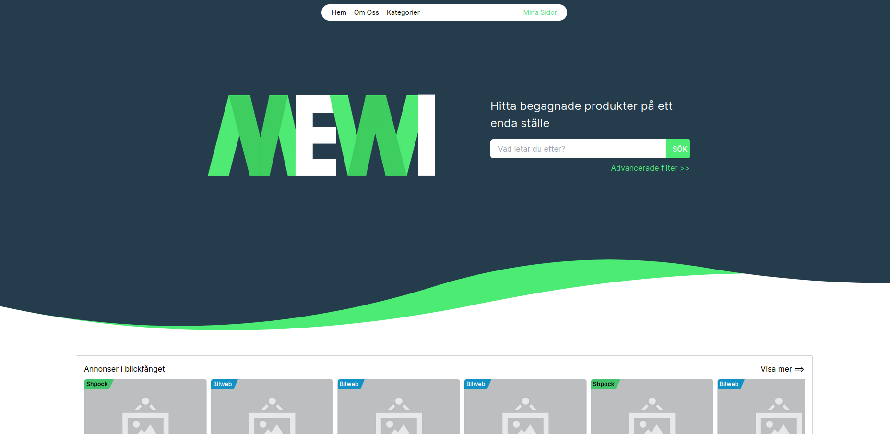
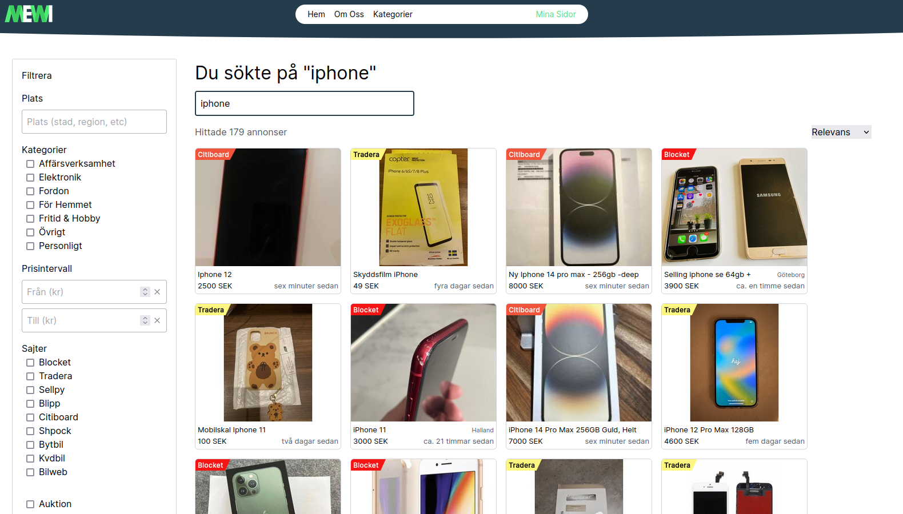
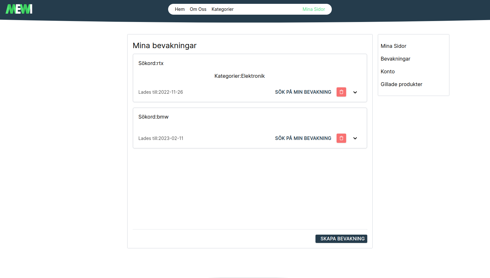

# Mewi

A web application to browse second hand listings from a wide variety of sources such as Blocket, Tradera, Sellpy, and so
on. Build with Next.js and includes three microservices built with TypeScript that listens to messages on a RabbitMQ
instance. The services handle notifications, emails, and scraping of websites.

## Project Screen Shot(s)

### Home page

### Search page

### Create alerts

When new items are added that match your search, you will receive a notification by email.

## Installation & setup

Clone down this repository. You will need `node`, `docker`, `docker-compose`, and `pnpm` installed globally on your
machine.

Install dependencies:

`pnpm install -F next-client`

To Start Server:

1. Start mongodb docker container by running `./scripts/startReplicateSetEnvironment.sh`. Wait for it to fully finish
   before proceeding. You may have to change permission with `chmod +x ./scripts/startReplicateSetEnvironment.sh` to run
   the script.
2. Run `pnpm run dev -F next-client`

To Start Microservices along with RabbitMQ (optional):

`cd docker && docker-compose up -d`

NOTE: Mongodb docker container must be running before starting containers, otherwise some services will fail.

To Visit App:

`localhost:3000`

## Reflection

I started this project around August 2022 as a business idea, however it turned into a personal side project instead.
The main goal for this project was to further
explore web development and build something that could be used as an actual service.

The idea for this project was to have a backend service that scrapes items from various second hand online marketplaces.
The clientside web page can then allow the user to browser and filter through the scraped items. I started out with
an `Express.js` and using `create-react-app` for the frontend. However, as the project grew, I realized it was hard to
keep a structured program using `Express.js`, so I rewrote the codebase using `Nest.js` and a `Next.js` frontend for
improved SEO. Later on, I combined the API into the Next.js frontend application so that I didn't have to pay for
hosting for the API on Google Cloud.

One of the hardest challenges I ran into was how to handle the scraping of the webpages. First, I had the API to run a
cronjob that executes the scrape code periodically. This worked fairly well with the API (that was written in `Next.js`
at the time), if you ignore the fact that the API shut down after a few minutes without incoming requests to reduce the
hosting cost. When migrating to using `Next.js`'s serverless functions, the approach did not work anymore. To solve
this, I made an endpoint at `/api/scrapers/next` that would start the scraping and used `https://cron-job.org/` to call
the endpoint every 5 minutes or so. However, I failed to realize the request would time out and effectively stop the
scraping. So the final solution I can up with was to create a smaller microservice that would listen to a `RabbitMQ`
queue and handle the scraping, which allowed the API to send a message to the queue and then return immediately.

Apart from using `Next.js` and the other aforementioned frameworks, the main frameworks/libraries used
are `redux`, `sass`, `tailwindcss`, `swc`, and `typescript`. The database used is MongoDB. `Docker` is used for
deploying the microservices to my Linux vm on DigitalOcean as well as running RabbitMQ in development.